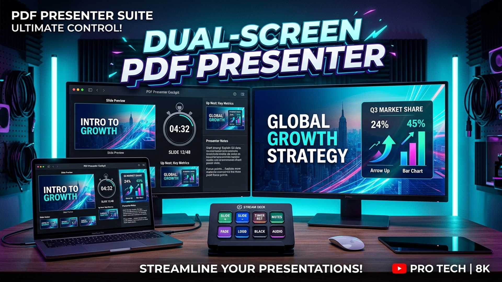

<div align="center">

# 📽️ PDF Presenter Suite

### Professional Dual-Screen Presentation Software for Keynotes, Conferences & AV Teams

<p>
  <a href="https://github.com/SHARUNJOSEPH/pdf-presenter/releases/latest">
    
  </a>
  <a href="https://apps.microsoft.com/detail/9NS3LKFXHBXW">
    
  </a>
  <a href="https://github.com/SHARUNJOSEPH/pdf-presenter/releases">
    
  </a>
</p>

<p>
  <a href="https://github.com/SHARUNJOSEPH/pdf-presenter/releases/latest">
    
  </a>
  <a href="https://github.com/SHARUNJOSEPH/pdf-presenter/releases">
    
  </a>
  <a href="LICENSE">
    
  </a>
  <a href="https://www.linkedin.com/in/joseph-sharun/">
    
  </a>
</p>

<br/>



<br/>
<br/>

</div>

---

## 📥 Quick Download & Installation

Choose your preferred way to download and use **PDF Presenter Suite**:

| Distribution Channel | Download Link | Notes |
| :--- | :--- | :--- |
| **Windows Setup Installer (.exe)** | [**⬇️ Click Here to Download (.exe)**](https://github.com/SHARUNJOSEPH/pdf-presenter/releases/latest) | **Recommended for Windows.** Multi-language NSIS installer, auto-detects system language, desktop & start menu shortcuts. |
| **Windows Standalone Portable (.exe)** | [**📦 Browse All Releases**](https://github.com/SHARUNJOSEPH/pdf-presenter/releases) | Zero-install standalone executable—run directly from an AV flash drive. |
| **Microsoft Store** | [**🛍️ Get from Microsoft Store**](https://apps.microsoft.com/detail/9NS3LKFXHBXW) | Verified and certified by Microsoft with silent automatic background updates. |
| **macOS Apple Disk Image (.dmg)** | [**🍎 Download for macOS (.dmg)**](https://github.com/SHARUNJOSEPH/pdf-presenter/releases/latest) | Drag-and-drop macOS installer package. |
| **macOS Portable (.zip)** | [**📦 Browse All Releases**](https://github.com/SHARUNJOSEPH/pdf-presenter/releases) | Standalone macOS application archive. |

> 💡 **Tip:** To manually find downloads on GitHub anytime, look at the **"Releases"** section on the right side of this page.

---

## 🌟 Key Features

- **Enterprise 11-Language Internationalization (i18n)**:
  - **11 Fully Localized Languages**: English (`en`), Español (`es`), Français (`fr`), Deutsch (`de`), 简体中文 (`zh`), 日本語 (`ja`), العربية (`ar`), Português (`pt`), हिन्दी (`hi`), Русский (`ru`), and Italiano (`it`).
  - **Auto-Detection**: Automatically detects the host operating system's native language upon launch.
  - **Arabic Right-to-Left (RTL) Support**: Complete RTL interface flow with strict bidirectional isolation (`unicode-bidi: isolate`) on timers, clocks, and slide counts to prevent digit inversion.
  - **Zero-Reload Live Synchronization**: Switching languages in the Presenter cockpit propagates instantaneously to the Audience display via `BroadcastChannel` without page reloads.
- **Multi-Screen Intelligent Routing**:
  - Automatically identifies all connected displays (primary screen, external monitors, HDMI projectors).
  - Clean fullscreen feed for the audience (no browser tabs, toolbars, or mouse pointers).
  - Dedicated **Presenter Cockpit** auto-maximized on your primary display.
- **Recent Presentations History**:
  - Quick-launch list on the setup screen remembers your last 5 opened slide decks.
  - 1-Click to reopen frequently used PDF presentations without searching folders.
- **Slide Sorter & Quick Jump Grid (`G`)**:
  - Instant visual grid modal displays high-resolution thumbnails for every slide in your deck.
  - Jump directly to any slide (e.g., Slide 15 during audience Q&A) without scrolling through intermediate slides in front of the audience.
- **Live Presentation Timer & Real-Time Wall Clock**:
  - Live stopwatch timer with Start/Pause/Reset controls.
  - Real-time digital clock displays local time-of-day so you never run over your session schedule.
- **PowerPoint-Style Adjustable Presenter Cockpit**:
  - **Draggable Vertical Splitter**: Adjust width between Current Slide and Sidebar on the fly.
  - **Draggable Horizontal Splitter**: Expand Speaker Notes into a tall teleprompter view or enlarge Next-Slide Preview.
  - **Layout Memory**: Saves custom panel proportions in `localStorage` across sessions (double-click to reset).
  - **Large Live Preview** of current slide with responsive aspect re-fitting.
  - **Next-Slide Glance Preview** for seamless speaking flow.
  - **Visual Slide Strip** with jump-to-slide thumbnails.
  - **Per-Slide Speaker Notes** with instant local auto-saving.
- **Silky 1.0s True Dissolve Transitions**:
  - Double-buffered canvas architecture eliminates all white flashes and flickering.
  - Smooth dissolve animation ensures a cinematic keynote experience.
- **Production Hardened & Developer Tools Lock-down**:
  - Standard Chromium menus and development tools are cleanly stripped from production builds.
  - Inspection shortcuts (`F12`, `Ctrl+Shift+I`) are blocked in release packages for a polished native desktop feel.
- **Interactive Tools & Keyboard Control**:
  - 🔴 **Virtual Laser Pointer**: Centered and synced live to the audience screen (`L`).
  - ✏️ **Digital Annotation Pen**: Draw and annotate slides in real-time (`P`).
  - ⬛ **Instant Blackout & Whiteout (`B` / `W`)**: Direct stage attention to the speaker.
  - 🗂️ **Slide Sorter Grid (`G`)**: Open bird's-eye slide grid to jump instantly to any slide.
  - 🛑 **Quick Exit (`Esc`)**: Press Esc anytime to close modals or exit presenter view cleanly.
  - ⛶ **Fullscreen Toggle (`F11`)**: Borderless distraction-free presenter view.
- **Bitfocus Companion & Stream Deck Integration**:
  - Built-in lightweight HTTP REST & WebSocket API on port `3000`.
  - **1-Click Companion Preset Export**: Generates ready-to-import `.companionconfig` files with 15 pre-styled colored keys (Next, Prev, Blackout, Timers, Laser).
  - 1-Click **"📋 Copy"** buttons for all API endpoints and network IP addresses.
  - Control slides, blackout, and timers directly from hardware production switchers or Stream Deck panels.
- **In-App Software Update Checker**:
  - Built-in GitHub Releases update engine checks for new builds automatically.
  - One-click update checking in the About dialog with direct download support.

---

## 🚀 Getting Started

### Option 1: Standalone Installers (No Node.js Required)
1. Download the [**Latest Windows Installer (.exe)**](https://github.com/SHARUNJOSEPH/pdf-presenter/releases/latest) or install directly from the [**Microsoft Store**](https://apps.microsoft.com/detail/9NS3LKFXHBXW).
2. Run the installer or open the application.
3. Select your PDF presentation (or click **Use Demo Deck**) and click **"Start Dual-Screen Presentation"**.

### Option 2: Running from Source
```bash
git clone https://github.com/SHARUNJOSEPH/pdf-presenter.git
cd pdf-presenter
npm install
npm start
```

---

## ⌨️ Keyboard Shortcuts

| Key | Action |
| --- | --- |
| `→` / `Space` / `PageDown` / `Enter` | Next Slide |
| `←` / `Backspace` / `PageUp` | Previous Slide |
| `Home` / `End` | First / Last Slide |
| `B` | Toggle Blackout Screen |
| `W` | Toggle Whiteout Screen |
| `L` | Toggle Virtual Laser Pointer |
| `P` | Toggle Digital Drawing Pen |
| `G` | Toggle Slide Grid Modal |
| `?` | Show Shortcuts Cheat Sheet |
| `F11` | Toggle Fullscreen Cockpit |
| `Esc` | Exit Presenter View / Close Modal |

---

## 🎛️ Bitfocus Companion / REST API (Port 3000)

| Endpoint | Method | Description |
| --- | --- | --- |
| `POST /api/next` | POST | Advance to next slide |
| `POST /api/prev` | POST | Return to previous slide |
| `POST /api/first` | POST | Jump to first slide |
| `POST /api/last` | POST | Jump to last slide |
| `POST /api/goto?page=N` | POST | Jump directly to slide `N` |
| `POST /api/blackout` | POST | Toggle stage blackout |
| `POST /api/whiteout` | POST | Toggle stage whiteout |
| `POST /api/timer/start` | POST | Start/resume presentation timer |
| `POST /api/timer/pause` | POST | Pause presentation timer |
| `GET /api/status` | GET | Retrieve live JSON presentation state |

---

## 👨‍💻 Creator & Community

Created with passion by **Joseph Sharun**:
- 💼 **LinkedIn**: [joseph-sharun](https://www.linkedin.com/in/joseph-sharun/)
- 🐙 **GitHub**: [@SHARUNJOSEPH](https://github.com/SHARUNJOSEPH)

This project is built to be open-sourced to empower speakers, educators, and AV professionals worldwide. Contributions, bug reports, and feature suggestions are warmly welcomed!

---

## 📄 License

Licensed under the [MIT License](LICENSE). Copyright © 2026 Joseph Sharun.
